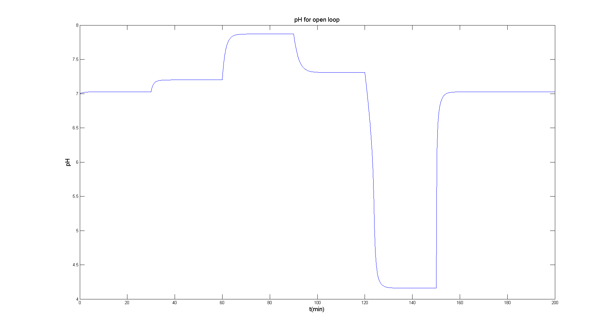
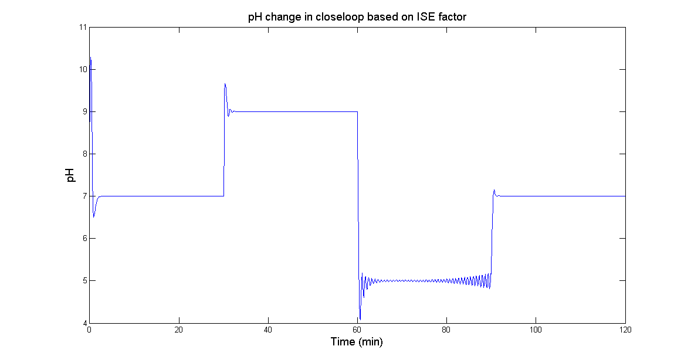
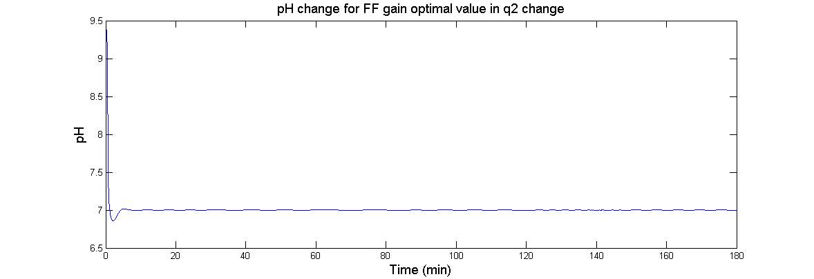
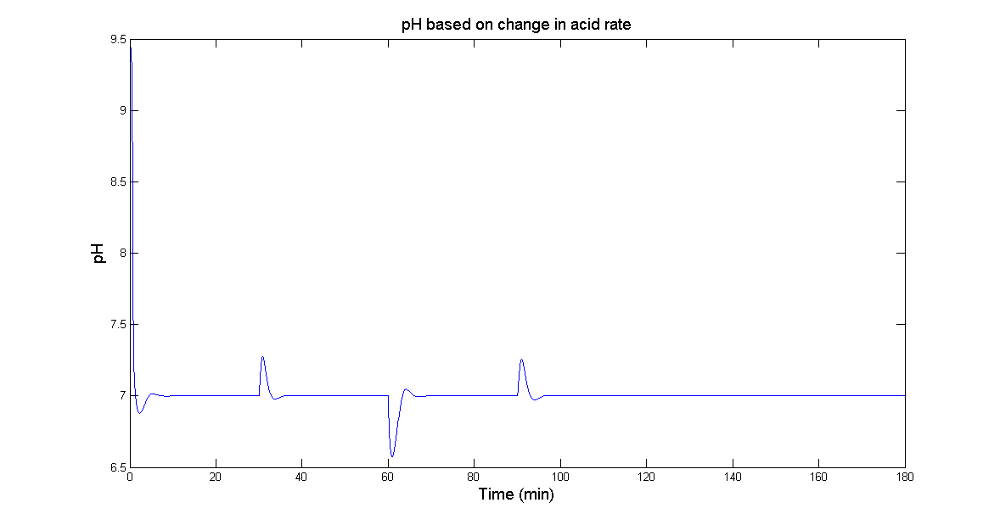

# pH Neutralization Process Control

A project for a graduate Modern Control course: pH control of a stirred-tank
neutralization process (acid/base/buffer streams into a tank, pH measured
after a transport delay), implemented in MATLAB/Simulink.

## Process

Three streams feed a stirred tank: an acid stream (`q1`), a buffer stream
(`q2`), and a base stream (`q3`, the manipulated variable). The process is
described by two ionic material balances, a level balance, and a nonlinear
algebraic charge balance that must be solved for pH:

```
dWa4/dt = (1/(A·h)) · [(Wa1−Wa4)q1 + (Wa2−Wa4)q2 + (Wa3−Wa4)q3]
dWb4/dt = (1/(A·h)) · [(Wb1−Wb4)q1 + (Wb2−Wb4)q2 + (Wb3−Wb4)q3]
dh/dt   = (1/A) · [q1 + q2 + q3 − Cv·(h+z)^n]

Wa4 + 10^(pH−14) − 10^(−pH) + Wb4 · (1+2·10^(pH−pK2)) / (1+10^(pK1−pH)+10^(pH−pK2)) = 0
```

`pK1, pK2` are the standard chemistry pKa values (`pK = −log10(Ka)`) of the
two weak-acid equilibria involved. The pH equation has no closed form, so
it's solved by Newton-Raphson every time the plant needs an output —
implemented in the process S-function,
[`functions/plant_simu.m`](functions/plant_simu.m).

There is a 10-second (0.167 model-time-unit) transport delay between the
tank and the pH sensor, representing the time for the mixed stream to reach
the measurement point.

## Steady state

The nominal operating point (pH = 7) is found by solving the four equations
above with `fsolve`
([`functions/StStsolver.m`](functions/StStsolver.m)):

```
Wa4_ss = -4.32e-4     Wb4_ss = 5.28e-4     h_ss = 14     q3_ss = 15.6
```

## Controller design

A PI controller, `Gc = k1 + k2/s`, is tuned against the nonlinear plant by:

1. **Direct optimization** (`fminunc`) against ISE/ITSE performance indices
   ([`functions/tunePI.m`](functions/tunePI.m)).
2. **Genetic algorithm** ([`functions/tunePIGA.m`](functions/tunePIGA.m)) as
   a fallback where `fminunc` fails to converge — this is a stiff, easily
   destabilized nonlinear loop.
3. **Feedforward compensation** for the buffer-stream disturbance (`q2`), a
   single static gain tuned the same way as (1)
   ([`functions/tuneFeedforwardGain.m`](functions/tuneFeedforwardGain.m)).

Robustness is checked by perturbing `q1` or `q2` around a tuned closed loop
(`functions/simulateClosedLoop.m` runs any of the `closeloop_PI*` models and
returns the response plus ISE/ITSE/IAE).

## Repository layout

```
models/       openLoopPH.slx, openLoop_q3.slx, openLoop_buffer.slx
              closeloop_PI.slx, closeloop_PI_FF.slx, closeloop_PI_Ga.slx
              closeloop_PI_q1_change.slx, closeloop_PI_q2_change.slx
functions/    plant_simu.m           nonlinear plant S-function
              StStsolver.m           steady-state solver
              tunePI.m               fminunc-based PI tuning (ISE/ITSE/IAE)
              tuneFeedforwardGain.m  fminunc-based FF gain tuning
              tunePIGA.m             GA-based PI tuning (fallback)
              simulateClosedLoop.m   generic closed-loop runner
results/      response plots (open-loop, closed-loop, FF, GA, robustness)
```

## Usage

Requires MATLAB with Simulink, the Optimization Toolbox (`fminunc`), and the
Global Optimization Toolbox (`ga`).

```matlab
addpath('functions'); addpath('models');

StStsolver();                          % steady-state table
[k1, k2] = tunePI('ISE');              % or 'ITSE'
k1_ff = tuneFeedforwardGain('ISE');
[k1, k2] = tunePIGA();                 % GA fallback (several minutes)
out = simulateClosedLoop('closeloop_PI_q1_change', k1, k2);
```

## Results

**Steady state** (pH = 7):

| Wa4_ss | Wb4_ss | h_ss | q3_ss |
|---|---|---|---|
| −4.32e-4 | 5.28e-4 | 14.0 | 15.6 |

**PI tuning (fminunc, `closeloop_PI`, initial guess k1=2.4, k2=4):**

| | k1 | k2 |
|---|---|---|
| ISE | 8.36 | 5.87 |
| ITSE | 8.36 | 5.94 |

**Feedforward gain (fminunc, `closeloop_PI_FF`):** `k1 = -1.8172`

**GA tuning (`closeloop_PI_Ga`):** `k1 = 7.64`, `k2 = 3.88`





